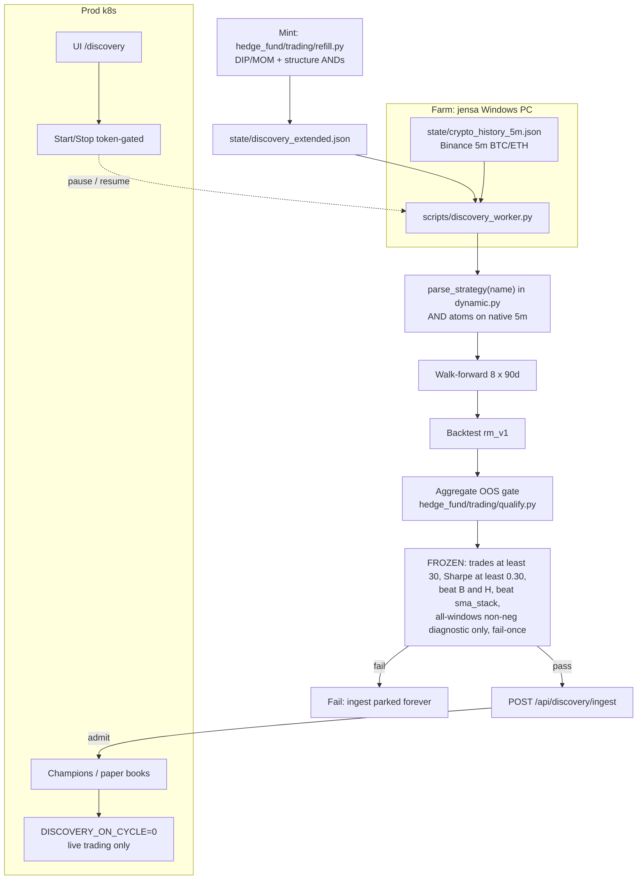
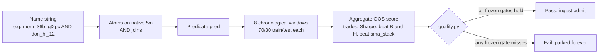
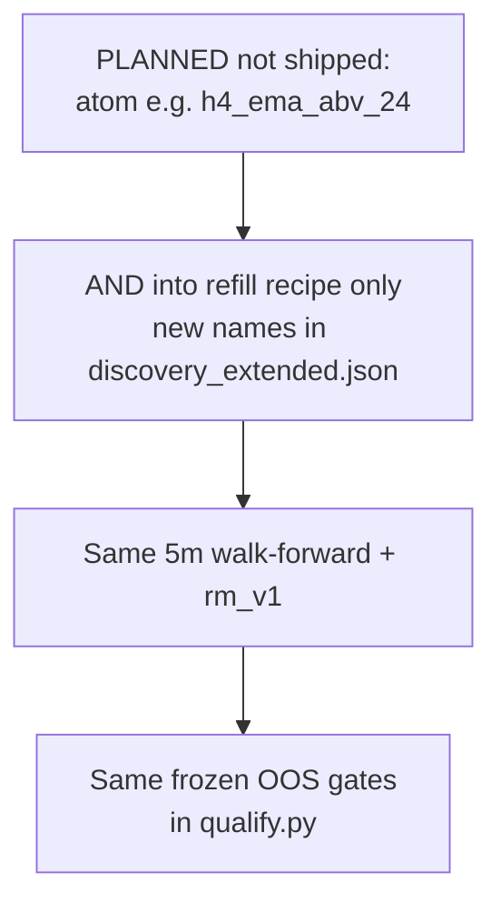

# Discovery and live workflow

**Paper only.** No real-money broker. OOS **thresholds** are frozen; these
diagrams do not change them.

Maintenance: update these diagrams in the same PR that changes mint/farm/eval/prod topology (refill recipe shape, window count, ingest, farm location, gate meaning).

This is the canonical map of how a name is minted, walked on jensa, gated,
ingested, and traded on the cluster. Read it on GitHub — the Mermaid
blocks render there. PROTOCOL amendments remain the honesty contract;
this file is the living topology.

## Legend

| Piece | Where | What it does |
|---|---|---|
| **Mint** | `hedge_fund/trading/refill.py` on the farm | Bounded DIP/MOM + structure AND recipe. When never-tested leftovers run dry, the next handful is appended to `state/discovery_extended.json`. Static `generate_universe()` stays inside the ~40–120 compiled-list band. |
| **Farm** | Alexander's Windows PC (`jensa`) | `scripts/discovery_worker.py` evaluates names against local `state/crypto_history_5m.json` (Binance 5m, **BTC/USDT and ETH/USDT only**). Same fail-once / auto-refill / aggregate-OOS / `rm_v1` / 5m rules as `scripts/tournament_engine.py`. |
| **Eval** | `parse_strategy` → walk-forward → backtest → gate | Name string → AND atoms on native 5m → 8 chronological ~90d windows → `rm_v1` paper backtest → aggregate OOS in `hedge_fund/trading/qualify.py`. |
| **Ingest** | `POST /api/discovery/ingest` | Token-gated. Pass → champion + isolated paper book on k8s. Fail → parked forever (fail-once). Existing champions are never culled. |
| **Prod** | k8s cycle sidecar | `DISCOVERY_ON_CYCLE=0` — live trading only (`run_isolated` → collect → report). Do not turn discovery back on in-cluster. UI: `/discovery`. |
| **Farm Start/Stop** | `/discovery` → `POST /api/discovery/farm` | Same ingest token. Worker **idles** (does not exit). Start cannot relaunch a dead process. |

**Current walk-forward (after [#43](https://github.com/Runemark7/paper-trading-bot/pull/43)):**
`QUAL_N_WINDOWS` = 8, `QUAL_WINDOW_DAYS` = 90, `QUAL_COVERAGE_DAYS` = 720
(~2y of native 5m). Per-window size stays 90d (honest hold-outs, not one
giant in-sample). Parked 3-window evals stay parked — ingest requalify
needs stored `regimes_tested` = 8. Re-fetch `crypto_history_5m.json` on
jensa so the tape actually covers the span.

**FROZEN OOS gates** (do not edit here to "make names pass"):

- OOS trades ≥ 30
- average OOS Sharpe ≥ 0.30
- beat buy-and-hold on the same test windows after fees
- beat `sma_stack` on those windows
- all-windows non-negative is a **diagnostic only** (not a veto)
- fail-once: a non-qualify parks that name forever

Train PnL is logged and never scored. Score is OOS-only.

Farm install and pause runbook: [WINDOWS_DISCOVERY.md](WINDOWS_DISCOVERY.md).
Honesty contract: [PROTOCOL.md](../PROTOCOL.md).

---

## 1. End-to-end: mint → farm → gate → live

Caption: Names are minted on the farm, walked on jensa against Binance 5m
BTC/ETH, then POSTed to prod. The cluster never runs walk-forwards.
Start/Stop on `/discovery` is token-gated and only idles the worker.

---

## 2. Inside one strategy name

Caption: `&` in the name is AND (every atom true on that 5m bar). Each
window backtests with `rm_v1`. A single empty or negative window is
logged (`all_windows_nonneg`) and does not veto. One fail parks the name.

---

## 3. Where HTF bias would fit (planned, not shipped)

Higher-timeframe bias is **not in the parser or the recipe today**.
`refill.py` still refuses `daily()` / `h1()` / `m5()` wrappers. If it
ships, it is a **mint recipe** change only — AND an extra atom into new
names. It is not a gate change.

Caption: An HTF tag such as `h4_ema_abv_24` would be one more AND atom
at mint time. Sharpe / trades / beat-B&H / beat-`sma_stack` / fail-once
stay as they are. Do not implement from this diagram.

---

## What this file is not

- Not a request to soften OOS thresholds.
- Not authorization to trade real funds. `GRADUATED_PAPER` is graduated
  paper only.
- Not a second copy of the jensa install steps — use
  [WINDOWS_DISCOVERY.md](WINDOWS_DISCOVERY.md).
