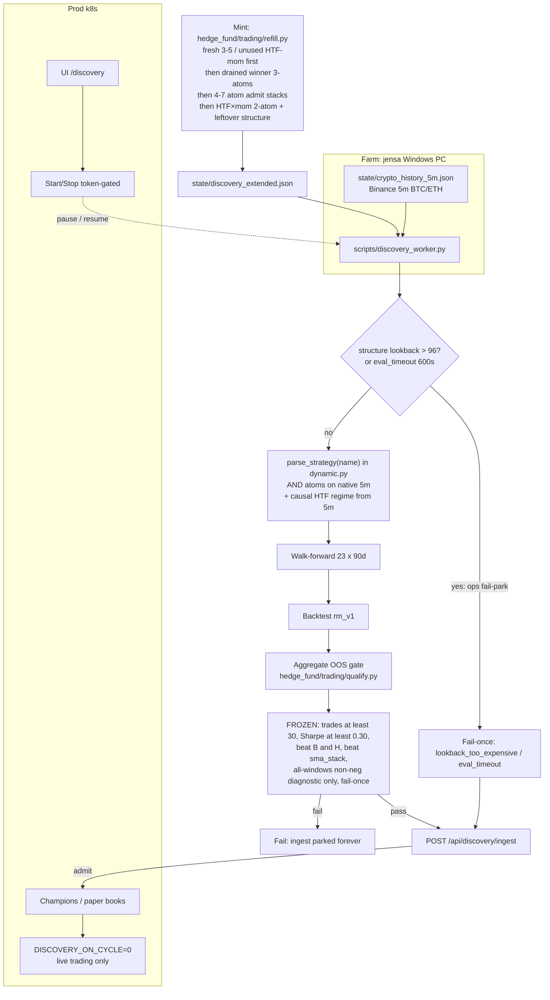
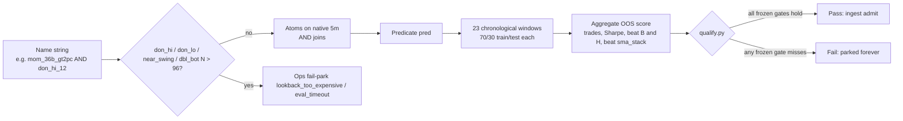
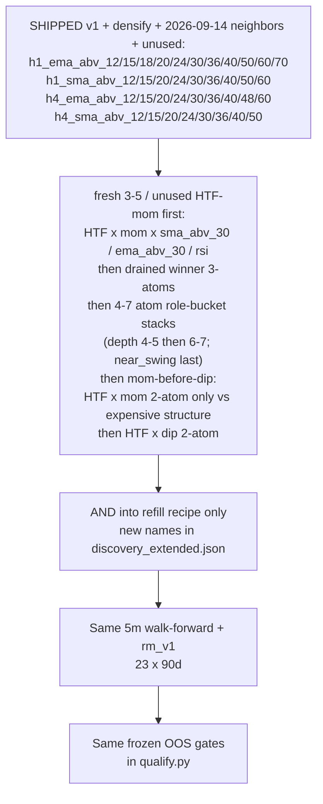

# Discovery and live workflow

**Paper only.** No real-money broker. OOS **thresholds** are frozen; these
diagrams do not change them.

Maintenance: update these diagrams in the same PR that changes mint/farm/eval/prod topology (refill recipe shape, window count, ingest, farm location, gate meaning).

This is the canonical map of how a name is minted, walked on jensa, gated,
ingested, and traded on the cluster. Read it on GitHub — the Mermaid
blocks render there. PROTOCOL amendments remain the honesty contract;
this file is the living topology.

## Legend

| Piece | Where | What it does |
|---|---|---|
| **Mint** | `hedge_fund/trading/refill.py` on the farm | Bounded DIP/MOM + structure AND recipe (`STRUCTURE_NS` through **96** — no `don_hi` / `don_lo` / `near_swing_*` / `dbl_bot` `N>96`), plus densified HTF buyer-regime ANDs (`h1_ema_abv_{12,15,18,20,24,30,36,40,50,60,70}` / `h1_sma_abv_{12,15,20,24,30,36,40,50,60}` / `h4_ema_abv_{12,15,20,24,30,36,40,48,60}` / `h4_sma_abv_{12,15,20,24,30,36,40,50}`). **Fresh never-tested families first**: unused HTF/mom (`REGIME_ATOMS_FRESH` / `MOM_FILTERS_HTF_FRESH`) and winner-shaped 3–5 stacks (REGIME+MOM × `sma_abv_30` / `ema_abv_30` × rsi-or-mild-dip, plus `rsi_14_>55`). Then drained admit-island **3-atoms first**: `regime&mom&mild_dip` then `regime&mom&sma_abv_50` / `ema_abv_20` (not HTF×mom×structure). Then **4–7 atom role-bucket stacks** on that island (depth 4–5 first, then 6–7; REGIME+MOM spine, 0–2 continuation, 0–1 mild dip, 0–1 RSI, cheap `near_swing_hi` N≤48 only at depth 7 — deprioritized). Then HTF×mom 2-atom (`regime&mom`, including `MOM_FILTERS_HTF_DENSE` / `MOM_FILTERS_HTF_EXPAND` / `MOM_FILTERS_HTF_FRESH`) — 2-atom only vs expensive structure — then HTF×dip 2-atom only. Mom-before-dip: `mom_18b_gt2pc` first among regime mom bases, `dip_24b_lt5pc` / `dip_24b_lt6pc` / `dip_18b_lt2pc` first among regime dip bases (`REGIME_DIP_PRIORITY`). When never-tested leftovers run dry, the next handful is appended to `state/discovery_extended.json`. Static `generate_universe()` stays inside the ~40–120 compiled-list band. |
| **Farm** | Alexander's Windows PC (`jensa`) | `scripts/discovery_worker.py` evaluates names against local `state/crypto_history_5m.json` (Binance 5m, **BTC/USDT and ETH/USDT only**). Same fail-once / auto-refill / aggregate-OOS / `rm_v1` / 5m rules as `scripts/tournament_engine.py`. Before walk-forward: structure lookback cap (`DISCOVERY_STRUCTURE_LOOKBACK_MAX` = 96) fail-parks `lookback_too_expensive`; 600s eval timeout is a backstop only. Ops/throughput, not a gate softening. |
| **Eval** | lookback guard → `parse_strategy` → walk-forward → backtest → gate | Name string → structure lookback cap → AND atoms on native 5m → 23 chronological ~90d windows → `rm_v1` paper backtest → aggregate OOS in `hedge_fund/trading/qualify.py`. |
| **Ingest** | `POST /api/discovery/ingest` | Token-gated. Pass → champion + isolated paper book on k8s. Fail → parked forever (fail-once). Ingest never culls existing champions. |
| **Prod** | k8s cycle sidecar | `DISCOVERY_ON_CYCLE=0` — live trading only (`run_isolated` → collect → report). Do not turn discovery back on in-cluster. UI: `/discovery`. |
| **Farm Start/Stop** | `/discovery` → `POST /api/discovery/farm` | Same ingest token. Worker **idles** (does not exit). Start cannot relaunch a dead process. |
| **Champion pool ops** | `POST /api/champions/retain` and `POST /api/champions/cull_undated` | Same ingest token. Explicit paper-ops exception: drop names from `champions.json` so `live_cycle` stops them. Does not delete trade DBs. `cull_undated` keeps only non-empty `champion_since`. |

**Current walk-forward (full jensa 5m tape):**
`QUAL_N_WINDOWS` = 23, `QUAL_WINDOW_DAYS` = 90, `QUAL_COVERAGE_DAYS` = 2070
(~5.67y of native 5m; 23 × 90). Per-window size stays 90d (honest hold-outs,
not one giant in-sample). Existing discovery_log admits were under 8 × 90d
(~720d) — no automatic re-qualify. Parked 8-window and 3-window evals stay
parked (fail-once). Ingest requalify needs stored `regimes_tested` = 23.
jensa `crypto_history_5m.json` already covers this span (~600787 bars).

**FROZEN OOS gates** (do not edit here to "make names pass"):

- OOS trades ≥ 30
- average OOS Sharpe ≥ 0.30
- beat buy-and-hold on the same test windows after fees
- beat `sma_stack` on those windows
- all-windows non-negative is a **diagnostic only** (not a veto)
- fail-once: a non-qualify parks that name forever

Train PnL is logged and never scored. Score is OOS-only.

Farm install and pause runbook: [WINDOWS_DISCOVERY.md](WINDOWS_DISCOVERY.md).
Honesty contract: [PROTOCOL.md](../PROTOCOL.md).

---

## 1. End-to-end: mint → farm → gate → live

Caption: Names are minted on the farm, walked on jensa against Binance 5m
BTC/ETH, then POSTed to prod. The cluster never runs walk-forwards.
Start/Stop on `/discovery` is token-gated and only idles the worker.
Lookback cap / eval timeout are farm ops (throughput) — they do not
change OOS thresholds. Mint no longer emits structure `N>96`; leftover
already-tested lookback-168/192 names stay parked. Worker fail-park
remains the backstop for any leftover already-queued name.

---

## 2. Inside one strategy name

Caption: `&` in the name is AND (every atom true on that 5m bar). Each
window backtests with `rm_v1`. A single empty or negative window is
logged (`all_windows_nonneg`) and does not veto. One fail parks the name.
Structure lookback > 96 skips walk-forward (ops, not a softer gate).

---

## 3. HTF buyer-regime atoms (shipped v1)

Higher-timeframe buyer-regime is **mint/parser only**. Causal 4h/1h
closes are resampled from the native 5m series; predicates use
**completed** HTF bars only (no lookahead). `daily()` / `h1()` / `m5()`
wrappers stay refused. Topology is unchanged: mint → farm → gate.

Atoms (discoverable, not one oracle): shipped v1 `h4_ema_abv_24`,
`h4_sma_abv_50`, `h1_ema_abv_24`, plus densified periods
`h1_ema_abv_15` / `h1_ema_abv_18` / `h1_ema_abv_20` /
`h1_ema_abv_30` / `h1_ema_abv_36` /
`h1_sma_abv_20` / `h1_sma_abv_24` / `h1_sma_abv_30` /
`h4_ema_abv_12` / `h4_ema_abv_48` / `h4_sma_abv_24`,
and 2026-09-14 neighbors `h1_ema_abv_{12,40,50}` /
`h1_sma_abv_{15,36,40}` / `h4_ema_abv_{20,30,36}` /
`h4_sma_abv_{20,30}`, then unused `h1_ema_abv_{60,70}` /
`h1_sma_abv_{12,50,60}` / `h4_ema_abv_{15,40,60}` /
`h4_sma_abv_{12,15,36,40}` (`REGIME_ATOMS_FRESH`).
`h1_ema_abv_36` stays distinct under `near_duplicate_key`;
`h1_ema_abv_18` shares canon with `h1_ema_abv_20` (18→20) but
the exact 18-period name is still in the recipe. `h1_sma_abv_{20,24,30}`
are SMA twins of the winning EMA island (distinct from ema; no
`h1_sma_abv_18` — 18→20). Long-only book:
HTF sellers → no new long (flat), not short. When HTF says buyers
and 5m is in a dip, that is buy-the-dip; disagree → HTF wins
(no long). Recipe emits **fresh never-tested families first**
(unused HTF/mom + winner-shaped 3–5: `sma_abv_30` / `ema_abv_30`
× rsi-or-mild-dip, `rsi_14_>55`) then admit-island **3-atoms first**
(`regime&mom&mild_dip`, then `regime&mom&sma_abv_50` / `ema_abv_20`)
then **4–7 atom role-bucket stacks** on that island (depth 4–5
first, then leftover new 3-atoms, then 6–7; spine REGIME+MOM;
cheap `near_swing_hi` N≤48 only at depth 7, deprioritized)
then HTF×mom **2-atom only** vs expensive structure (no structure AND —
no `don_hi` / `near_swing_lo` AND on that family, and HTF×dip stays 2-atom only)
**before** leftover HTF×dip — mom-before-dip — with `mom_18b_gt2pc`
first among regime mom bases and `dip_24b_lt5pc` / `dip_24b_lt6pc` /
`dip_18b_lt2pc` first among regime dip bases (`REGIME_DIP_PRIORITY`;
`dip_24b_lt4pc` is not minted — same canon as lt5), then leftover
mean-reversion. Short-continuation
dense mom (`mom_18b_gt4pc` / `mom_18b_gt6pc` / `mom_12b_gt6pc`)
and unused expand grids (`MOM_FILTERS_HTF_EXPAND` /
`MOM_FILTERS_HTF_FRESH`)
AND onto every HTF tag. OOS gates are unchanged.

Caption: An HTF tag is one more AND atom at mint time. Sharpe / trades /
beat-B&H / beat-`sma_stack` / fail-once / `QUAL_N_WINDOWS` stay as they
are. Still mint → farm → gate.

---

## What this file is not

- Not a request to soften OOS thresholds.
- Not authorization to trade real funds. `GRADUATED_PAPER` is graduated
  paper only.
- Not a second copy of the jensa install steps — use
  [WINDOWS_DISCOVERY.md](WINDOWS_DISCOVERY.md).
